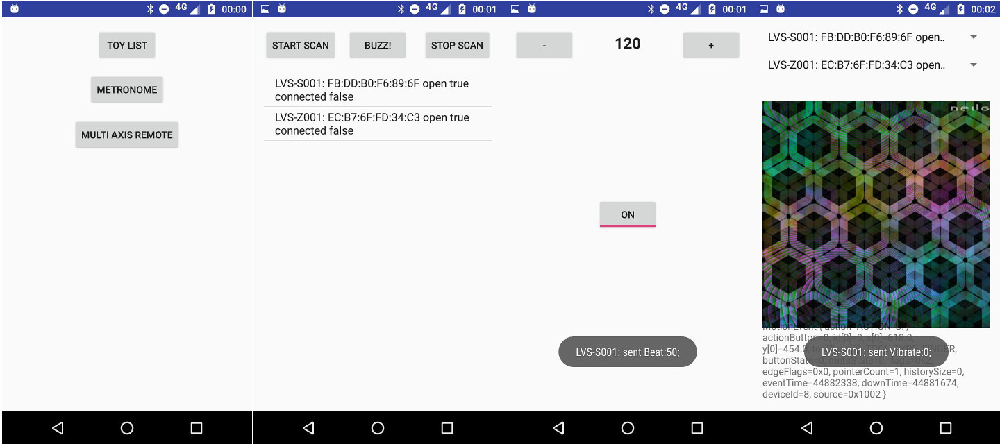

Vibr8
=====

An Android app to expose a socket interface that can discover, enumerate, and control Lovense toys
via a simple API.

The main menu allows flow to a toy picker activity, from where toys can be scanned and opened. Once
one or more toys are opened and connected, they can be controlled from the metronome and the
multiaxis vibrator (which allows independent control of two toys via X and Y location of touch).

**TODO**

- Background service now operational, but needs making more robust to cater for Android Bluetooth LE stack
bugs.
    - LovenseToy should be split into a LovenseBluetoothToy that the service uses to connect and issue direct
    bluetooth commands, and a LovenseProxy that actions can use to register **intents**. connect()
    on the proxy should register an intention to connect a toy, which the service should observe
    and do whatever is necessary to connect it. Using the buggy Bluetooth stack, this may mean
    several hardware connect/disconnect/service discovery attempts until a robust connection is made.
        Actions should thus be insulated from bluetooth implementation details.
- Listen on a socket and allow clients to:
    - scan for toys and enumerate them
    - configure toys into groupings
    - persistently connect to toy groups and maintain if they go out of range and reappear
    - send commands (either immediate execution, or schedule for a future time) to toy groups
    - intelligently handle multiple overlapping commands (e.g. two vibration requests for the same time should pick highest intensity?)
- Write a webpage that will use JS socket API to control toys
- Write some neat multitoy demonstrators - perhaps sine wave generators that allow frequency/amplitude to be set independently per toy

