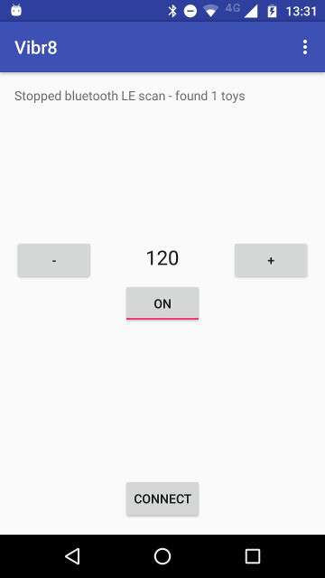

Vibr8
=====

An Android app to expose a socket interface that can discover, enumerate, and control Lovense toys via a simple API.

Currently contains a single activity, a Metronome app, that allows scanning for Bluetooth LE devices. Any with a name beginning LVS- are connected, and pulse commands sent when the metronome is active.

**TODO**

- Refactor into a background service - currently when the UI is rotated or goes into the background, the scanner and state of discovered toys is destroyed. This needs to be made a lot more persistent and robust.
- Listen on a socket and allow clients to:
    - scan for toys and enumerate them
    - configure toys into groupings
    - persistently connect to toy groups and maintain if they go out of range and reappear
    - send commands (either immediate execution, or schedule for a future time) to toy groups
    - intelligently handle multiple overlapping commands (e.g. two vibration requests for the same time should pick highest intensity?)
- Refactor Metronome app to use the background service
- Write a webpage that will use JS socket API to control toys
- Test it continues to robustly operate in the background

